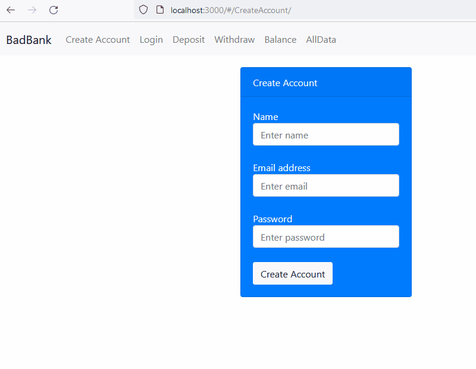

# Three Tiered Banking App
This is an unsecured banking app created with the MERN stack

## Description
This project was created as a part of MIT xPRO Professional Certificate in Coding program.  

## Installation Guidelines
1 - Clone the repo to your git desktop
2 - Install Node.js, Docker desktop and MongoDB softwares on your machine
3 - Run 'npm install' in the project folder
4 - Create a MongoDB database with docker using 'docker run -p 27017:27017 --name bank-app -d mongo'
5 - Run 'node index.js' in the terminal at the root of the project folder
6 - Browse to http://localhost:3000 in a chrome/mozilla browser

## App

## Tech stack
MongoDB, Express, Reactjs, Nodejs, Docker, HTML, CSS, Javascript

## Features
Lets you create an account, login, deposit, withdraw, view balance and see all activity.  
Work in progress: Authentication and Authorization

## License
MIT
